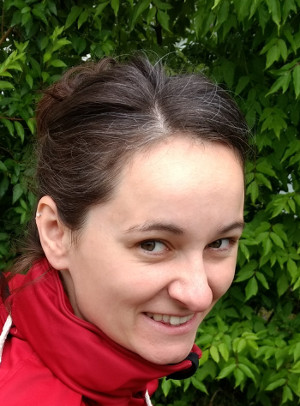

## Mirjam Friesen

I am a PhD student at [Otto von Guericke Universität Magdeburg](www.ovgu.de) in the [discrete optimization group](http://www.math.uni-magdeburg.de/institute/imo/ag_kaibel/).

### Short CV

- Since 2014: PhD Student under supervision of [Volker Kaibel](http://www.math.uni-magdeburg.de/~kaibel/) at _OvGU Magdeburg_
- 2014: Master of Science _OvGU Magdeburg_
- 2012: Bachelor of Science _OvGU Magdeburg_

### Publications

**Polytope der 0-1-Optimierung mit einem quadratischen Term**
Master thesis, OvGU Magdeburg (2014)
supervised by [Volker Kaibel](http://www.math.uni-magdeburg.de/~kaibel/) 
([pdf](masterarbeit.pdf))

**Fooling sets and rank**
With Aya Hamed, Troy Lee and Dirk Oliver Theis,
_European Journal of Combinatorics_ (2015)
([arXiv.1208.2920](https://arxiv.org/abs/1208.2920))

**Fooling-sets and rank in nonzero characteristic (extended abstract)**
With Dirk Oliver Theis
_Proceedings of EuroComb_ (2013) 383--390
([arXiv.1305.2468](https://arxiv.org/abs/1305.2468))

**Foolingsets und erweiterte Formulierungen**
Bachelor thesis, OvGU Magdeburg (2012)
supervised by [Dirk Oliver Theis](https://www.theory.cs.ut.ee/people/dot)
([pdf](bachelorarbeit.pdf))
